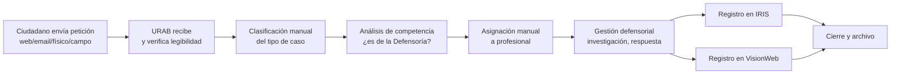
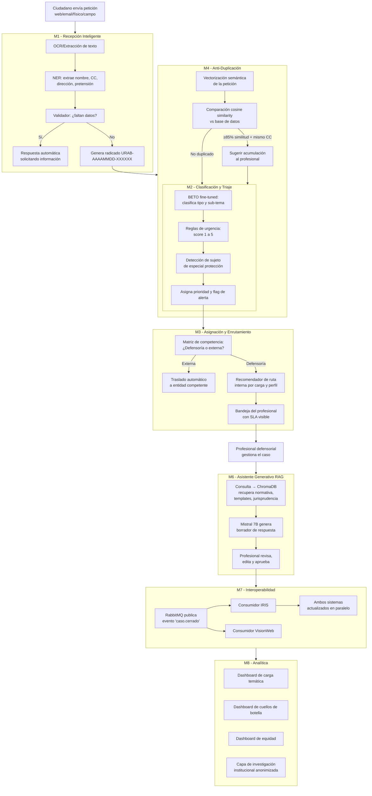

# 4. Modelo "to-be" y alcance del piloto (diseño técnico viable)

## ¿Qué es esta sección?

Aquí muestras **cómo sería el proceso de la Defensoría del Pueblo si tuviera la IA funcionando**. Comparas el proceso actual (manual, lento, con errores) con el proceso futuro (automatizado, con IA asistiendo a los funcionarios). También defines el **alcance del piloto**: no vas a implementar todo de golpe, sino una primera fase acotada que demuestre que la solución funciona.

**Extensión sugerida:** 3-4 páginas (compartida con el equipo de Derecho; la parte de DS son ~2 páginas).

---

## ¿Qué necesitas del equipo de Derecho?

| # | Entregable | Para qué lo necesitas |
|---|---|---|
| D1 | 4 categorías jurídicas con definiciones y ejemplos (Asesoría, Queja, Mediación, Conciliación) | Para que el flujo TO-BE clasifique correctamente |
| D2 | Catálogo de ~12 sub-temas (salud, pensiones, prisiones, VBG, etc.) | Para definir las ramas del clasificador |
| D3 | Sujetos de especial protección constitucional | Para activar alertas de prioridad en el flujo |
| D4 | Matriz de competencias (tipo + sub-tema → entidad competente) | Para la etapa de asignación/enrutamiento |

**Sin estos inputs no puedes dibujar el TO-BE correctamente. Pídeselos hoy.**

---

## Paso a paso para redactar esta sección

### Paso 1: Diagrama AS-IS (proceso actual, sin IA)

Dibuja cómo funciona HOY la Defensoría. Esto ya lo tienes en `PLAN_CIENCIA_DE_DATOS.md`. Hazlo en Mermaid (texto que se convierte en diagrama automáticamente):

**Texto que acompaña al diagrama (ejemplo para copiar y adaptar):**

> "Actualmente, el macroproceso de gestión de peticiones en la Defensoría del Pueblo es predominantemente manual. Un funcionario de la URAB recibe la petición por diversos canales (web, correo electrónico, físico, jornadas de campo), verifica su legibilidad y completitud, clasifica manualmente el tipo de caso (Asesoría, Queja, Solicitud de Mediación o Solicitud de Conciliación), determina si la Defensoría es competente o si debe trasladarse a otra entidad, asigna el caso a un profesional defensorial, quien gestiona la investigación y elabora la respuesta, para finalmente registrar el caso tanto en IRIS como en VisionWeb —dos sistemas que no se comunican entre sí, obligando a doble digitación— antes de proceder al cierre y archivo."

### Paso 2: Los 5 problemas críticos del AS-IS

Describe cada problema actual en una tabla:

| # | Problema | Causa | Consecuencia |
|---|---|---|---|
| 1 | **Volumen y saturación operativa** (~300 peticiones/día) | Clasificación manual consume ~15 min por caso. Cada funcionario solo puede procesar ~30 casos/día. | Represamiento, demoras, respuestas fuera de términos legales. |
| 2 | **Riesgo jurídico por represamiento** | Sin sistema de priorización, casos urgentes (amenazas, menores, VBG) se mezclan con consultas rutinarias. | Vulneración de derechos fundamentales, acciones de tutela contra la Defensoría. |
| 3 | **Duplicidad de registro IRIS/VisionWeb** | Los dos sistemas no están integrados. El profesional debe digitar la misma información dos veces. | Retrabajo, errores de digitación, inconsistencias entre sistemas. |
| 4 | **Duplicidad de peticiones** | Un mismo ciudadano presenta la misma queja hasta 10 veces sin que el sistema lo detecte. | Desgaste operativo, múltiples respuestas al mismo caso, confusión. |
| 5 | **Peticionarios recurrentes sin trazabilidad** | No hay historial unificado. Cada nueva petición se trata como si fuera la primera. | Respuestas inconsistentes, desconocimiento del contexto del ciudadano. |

### Paso 3: Diagrama TO-BE (proceso futuro, con IA)

Así se vería el proceso con los 8 módulos de IA integrados:

**Texto que acompaña al diagrama (ejemplo):**

> "En el modelo TO-BE, la inteligencia artificial se integra como una capa de asistencia que automatiza tareas repetitivas y apoya —nunca reemplaza— la toma de decisiones del profesional defensorial. La petición ingresa por cualquier canal y es procesada por M1 (Recepción Inteligente), que mediante OCR y extracción de entidades (NER) captura automáticamente los datos del ciudadano y el contenido de su solicitud. M4 (Anti-Duplicación) verifica si esta petición ya existe en el sistema usando comparación semántica. M2 (Clasificación y Triaje) asigna tipo, sub-tema, nivel de urgencia y detecta si el peticionario pertenece a un grupo de especial protección constitucional. M3 (Asignación) determina la entidad competente y, si es la Defensoría, recomienda la ruta interna óptima. El profesional gestiona el caso con el apoyo de M6 (Asistente Generativo), que mediante RAG —una técnica que consulta una base de conocimiento antes de generar texto, evitando que la IA invente información— produce un borrador de respuesta que el profesional siempre revisa y aprueba. Finalmente, M7 sincroniza simultáneamente el caso en IRIS y VisionWeb, y M8 alimenta dashboards de analítica para la toma de decisiones institucionales."

### Paso 4: Alcance del piloto

Define qué se implementa en la Fase 1 (piloto). Sé realista: no todo de golpe.

| Elemento | Definición para el piloto |
|---|---|
| **Módulos incluidos** | M1 (Recepción), M2 (Clasificación), M3 (Asignación), M4 (Anti-Duplicación), M7 (Interoperabilidad en modo espejo: lee de IRIS/VisionWeb pero no escribe), M8 (Dashboard 1: carga temática) |
| **Módulos excluidos** | M5 (Historial unificado), M6 (Asistente RAG completo — solo respuestas automáticas del catálogo D5), M8 dashboards avanzados |
| **Regional** | Una regional de alto volumen (ej: Bogotá) |
| **Volumen** | ~300 peticiones/día durante 3 meses |
| **Usuarios** | 5-8 profesionales de URAB + 2 administradores |
| **Duración** | 6 meses |
| **Criterios de éxito** | Precisión de clasificación >85%, tasa de duplicados detectados >85%, tiempo ingreso→asignación <4 horas, disponibilidad >99% |
| **Criterios de salida** | Si precisión <75% → no escalar sin reentrenar. Si <70% → suspender y rediseñar |

### Paso 5: Tabla de mapeo problema → solución

Cierra la sección mostrando cómo cada módulo ataca uno o más de los 5 problemas:

| Problema crítico | Módulo(s) que lo resuelven | Cómo lo resuelve |
|---|---|---|
| Volumen y saturación | M1, M2, M6 | Automatiza recepción y clasificación. Libera al profesional de tareas repetitivas. |
| Riesgo jurídico por represamiento | M2, M3 | Prioriza casos urgentes. SLAs visibles con alertas. |
| Doble registro IRIS/VisionWeb | M7 | Sincronización simultánea. Un solo punto de entrada. |
| Duplicidad de peticiones | M4 | Detección semántica automática. Acumulación sugerida. |
| Peticionarios sin historial | M5 | Índice unificado. Historial consolidado en segundos. |

---

## Glosario de términos técnicos usados en esta sección

| Término | Explicación |
|---|---|
| **OCR** | Reconocimiento Óptico de Caracteres. Convierte una foto o PDF escaneado en texto que la computadora puede leer. |
| **NER** | Reconocimiento de Entidades Nombradas. Extrae automáticamente datos como nombres, números de cédula, direcciones, etc. de un texto. |
| **Radicado** | Número único que identifica cada petición. Ejemplo: URAB-20260115-000342. |
| **Fine-tuning** | Tomar una IA que ya sabe español y enseñarle a hacer una tarea específica (como clasificar tipos de quejas). |
| **RAG** | Retrieval-Augmented Generation. Técnica donde la IA primero busca en una base de conocimiento antes de escribir una respuesta. Así evita inventar datos. |
| **Cosine similarity** | Medida matemática que indica qué tan parecidos son dos textos. 0 = no se parecen en nada, 1 = son idénticos. |
| **SLA** | Service Level Agreement. Tiempo máximo prometido para completar una tarea. Ej: "asignar un caso en máximo 4 horas". |
| **Sujeto de especial protección** | Persona que por su condición (niño, adulto mayor, víctima, discapacitado, etc.) tiene protecciones legales reforzadas. |
| **TO-BE** | Cómo será el proceso en el futuro, con la mejora implementada. |
| **AS-IS** | Cómo es el proceso actualmente, sin cambios. |
