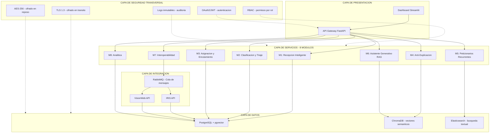

# 5. Arquitectura técnica de la solución

## ¿Qué es esta sección?

Aquí describes **el diseño completo del sistema por dentro**: cómo se organiza en capas, qué tecnologías usa, qué hace cada módulo (M1 a M8), cómo se integra con IRIS y VisionWeb, cómo se protegen los datos y cómo se mantiene la IA funcionando bien en el tiempo (MLOps).

Es la sección más importante del aporte de Ciencia de Datos. Describes todo conceptualmente, sin necesidad de programarlo realmente.

**Extensión sugerida:** 6-8 páginas.

---

## ¿Qué necesitas del equipo de Derecho?

| # | Entregable | Para qué lo necesitas |
|---|---|---|
| D1 | 4 categorías jurídicas + ejemplos | M2 (clasificador primario) |
| D2 | Catálogo de ~12 sub-temas | M2 (sub-clasificador multi-etiqueta) |
| D3 | Sujetos de especial protección | M2 (priorizador + alertas) |
| D4 | Matriz de competencias | M3 (enrutamiento) |
| D5 | Catálogo de consultas automatizables | M6 (respuestas automáticas) |
| D6 | Templates de respuesta (10-20) | M6 (RAG + borradores) |
| D7 | Criterios de urgencia | M2 (scoring de urgencia) |
| D8 | Umbral de duplicación | M4 (threshold de similitud) |
| D9 | Roles RBAC | Arquitectura de seguridad |

**Sin los D1-D9 no puedes describir el comportamiento concreto de los módulos.**

---

## Paso a paso para redactar esta sección

### Paso 1: Arquitectura lógica (diagrama de capas)

El sistema se organiza en 5 capas, como un edificio. Cada capa depende de la de abajo.

**Texto de acompañamiento:**

> "La arquitectura propuesta sigue un modelo de capas que separa responsabilidades: presentación (interfaces de usuario y API), servicios (los 8 módulos funcionales), integración (comunicación con IRIS y VisionWeb), datos (almacenamiento transaccional, vectorial y de búsqueda) y seguridad (capa transversal que aplica a todas las anteriores). Esta separación permite escalar cada capa de forma independiente y facilita el mantenimiento futuro."

### Paso 2: Stack tecnológico con justificación

| Capa | Tecnología | ¿Para qué sirve? | ¿Por qué esta y no otra? | Licencia |
|---|---|---|---|---|
| Backend | FastAPI (Python) | Recibir peticiones web, conectar los módulos, exponer APIs | Es rápido, genera documentación automática y funciona bien con bibliotecas de IA | MIT |
| Clasificación de texto | BETO fine-tuned | Clasificar peticiones en Asesoría/Queja/Mediación/Conciliación | Es un modelo de IA entrenado específicamente en español por la Universidad de Chile. Más ligero y rápido que alternativas como RoBERTa. Ya ha sido probado en tareas de dominio legal | MIT |
| Extracción de datos (NER) | spaCy (es_core_news_lg) | Extraer nombres, cédulas, direcciones, pretensiones de los textos | Biblioteca madura y robusta para procesamiento de lenguaje en español. Permite fine-tuning con datos propios | MIT |
| Similitud semántica | Sentence-Transformers (paraphrase-multilingual-mpnet-base-v2) | Convertir textos en vectores numéricos para comparar su significado | Modelo multilingüe probado. Genera representaciones (embeddings) de 768 dimensiones que capturan el significado del texto | Apache 2.0 |
| Asistente generativo (LLM) | Mistral 7B | Generar borradores de respuesta a peticiones ciudadanas | Es de código abierto (no hay que pagar licencia). Corre en servidor propio (los datos no salen de la Defensoría). Es eficiente en recursos | Apache 2.0 |
| Búsqueda en base de conocimiento (RAG) | LangChain + ChromaDB | Buscar normativa, jurisprudencia y templates relevantes antes de que el LLM genere una respuesta | LangChain es el framework estándar para RAG. ChromaDB es ligero, gratuito y no requiere servidor aparte | MIT / Apache 2.0 |
| Reconocimiento de texto en imágenes (OCR) | Tesseract LSTM (español) + OpenCV | Leer documentos escaneados o fotos de formularios | Gratuito, open-source. Alcanza <5% de error en documentos limpios | Apache 2.0 |
| Base de datos principal | PostgreSQL + pgvector | Guardar casos, ciudadanos, profesionales, respuestas. También vectores semánticos en la misma BD | Robusto, usado en gobierno. pgvector evita tener una BD separada para vectores | PostgreSQL License |
| Búsqueda textual | Elasticsearch | Buscar en el historial de peticiones por nombre, CC, palabras clave | Motor de búsqueda escalable y rápido. Ideal para búsquedas sobre texto libre | Elastic License 2.0 |
| Mensajería entre sistemas | RabbitMQ | Comunicar el nuevo sistema con IRIS y VisionWeb de forma confiable | Estándar en sector público. Garantiza que los mensajes no se pierdan aunque un sistema esté caído | Mozilla Public License 2.0 |
| MLOps (mantenimiento de IA) | MLflow + DVC + Evidently AI | Versionar modelos, monitorear su rendimiento, detectar cuándo se degradan | MLflow es el estándar de la industria. DVC versiona datos como Git versiona código. Evidently monitorea en producción | Apache 2.0 |
| Dashboard | Streamlit (piloto) + Power BI (producción) | Visualizar métricas para directivos y profesionales | Streamlit permite prototipado rápido. Power BI ya se usa en el sector público colombiano | Apache 2.0 / Licencia Microsoft |
| Infraestructura | Docker + Docker Compose | Empaquetar todo el sistema en contenedores para que funcione igual en cualquier servidor | Portabilidad total. Fácil de desplegar, escalar y mantener | Apache 2.0 |
| Seguridad | OAuth2/JWT, TLS 1.3, AES-256 | Autenticar usuarios, cifrar comunicaciones y datos almacenados | Estándares de industria. JWT es sin estado (no requiere sesiones en servidor). TLS 1.3 es la versión más reciente y segura | Estándares abiertos |

### Paso 3: Descripción de cada módulo (M1 a M8)

Para cada módulo escribe: (1) qué hace, (2) componentes clave, (3) métrica principal. NO más de 2 párrafos por módulo. La descripción detallada va en el Anexo B.

---

#### M1 — Recepción Inteligente

**Qué hace:** Recibe peticiones por todos los canales, extrae automáticamente los datos del ciudadano y del caso, verifica que no falte información crítica, y genera un número de radicado único.

**Componentes clave:**
- **API Gateway:** Recibe peticiones vía web (formulario JSON), correo electrónico (parser de email), PDF escaneado (OCR de Tesseract), imagen/foto (OCR + preprocesamiento OpenCV). Un solo punto de entrada.
- **NER Pipeline:** spaCy fine-tuned extrae entidades: nombre, tipo de documento, número de documento, dirección, teléfono, email, hecho (lo que pasó), pretensión (lo que pide).
- **Validador de completitud:** Reglas declarativas. Si falta nombre, CC o descripción del hecho → respuesta automática inmediata solicitando la información faltante. Si los datos están completos → genera radicado.
- **Generador de radicado:** Formato URAB-{YYYYMMDD}-{SEQ:06}. Ejemplo: URAB-20260115-000342.

**Métrica principal:** Tasa de extracción correcta de entidades >90%.

---

#### M2 — Clasificación y Triaje

**Qué hace:** Lee el texto de la petición y automáticamente determina: (a) el tipo de caso entre las 4 categorías jurídicas, (b) el sub-tema o sub-temas (una petición puede tratar varios temas a la vez), (c) el nivel de urgencia (1=baja, 5=crítica), y (d) si el peticionario pertenece a un grupo de especial protección constitucional.

**Componentes clave:**
- **Clasificador primario:** Modelo BETO con fine-tuning para clasificar en 4 categorías (Asesoría, Queja, Mediación, Conciliación). Usa una capa Softmax que asigna probabilidades a cada categoría y elige la más alta.
- **Sub-clasificador multi-etiqueta:** El mismo backbone BETO, pero con una cabeza diferente que permite asignar múltiples sub-temas simultáneamente (~12 etiquetas posibles). Usa binary cross-entropy como función de error.
- **Scorer de urgencia:** Sistema de reglas (no IA). Busca palabras clave y patrones que indiquen riesgo: "amenaza", "desaparición", "menor en peligro", "violencia", "riesgo de vida". Asigna nivel 1-5 según los criterios jurídicos D7.
- **Priorizador:** Determinístico. Cruza el texto con el catálogo de sujetos de especial protección (D3). Si detecta pertenencia a un grupo protegido → flag automático de prioridad.
- **Evaluación de equidad (fairness):** Se monitorean métricas de equidad por género, región y grupo de especial protección. Si se detecta disparidad >5% entre grupos, se activa un protocolo de revisión y mitigación.

**Métrica principal:** Accuracy (porcentaje de aciertos) >85%, F1 por clase >0.80, tasa de falsos negativos en urgencia <1% (muy grave dejar pasar un caso urgente sin marcarlo).

---

#### M3 — Asignación y Enrutamiento

**Qué hace:** Una vez clasificada la petición, determina qué entidad debe atenderla. Si es competencia de la Defensoría, recomienda a qué profesional o regional asignarla. Si es de otra entidad, genera la notificación de traslado automáticamente.

**Componentes clave:**
- **Matriz de competencia:** Tabla de reglas declarativas: (tipo + sub-tema) → entidad competente + dirección + contacto. Alimentada por D4 de Derecho. Si el caso no es de la Defensoría, el sistema genera la notificación de traslado con todos los datos.
- **Recomendador de ruta interna:** Sistema híbrido. Reglas base (por tipo de caso y regional) + scoring opcional basado en historial de asignaciones exitosas. Distribuye la carga entre profesionales disponibles.
- **Bandejas de trabajo:** API REST con estados: pendiente, asignado, en_gestión, escalado, cerrado. Colas de trabajo separadas por profesional y por URAB.
- **Monitor de SLA:** Tiempos máximos: ingreso → asignación (<4 horas), asignación → inicio de gestión (<24 horas), inicio → cierre (<15 días hábiles). Alertas automáticas al 80% y 100% del plazo.

**Métrica principal:** Tiempo ingreso → asignación <4 horas en el 95% de los casos (p95).

---

#### M4 — Anti-Duplicación

**Qué hace:** Antes de crear un nuevo caso, verifica si ya existe una petición igual o muy similar del mismo ciudadano. Si la detecta, sugiere al profesional acumularlas en lugar de crear un caso nuevo.

**Componentes clave:**
- **Vectorizador:** Sentence-Transformers convierte el texto de la petición en un vector numérico de 768 dimensiones (embedding) que representa su significado. Esto permite comparar textos aunque usen palabras distintas.
- **Motor de similitud:** Calcula cosine similarity entre el embedding de la nueva petición y los embeddings de los últimos K casos (K=10 más cercanos). Aplica un filtro adicional: mismo número de documento + misma pretensión (extraída por NER).
- **Umbral configurable:** Por defecto 85% de similitud. Si la similitud supera este umbral Y coincide el CC Y coincide la pretensión → se sugiere acumulación. El umbral es ajustable por el administrador y validado jurídicamente (D8).
- **UI de decisión:** El profesional ve una pantalla con: petición nueva, petición existente, porcentaje de similitud, campos coincidentes resaltados. Puede: aceptar acumulación, rechazar (con motivo obligatorio), o marcar como relacionado sin acumular.

**Métrica principal:** Precision >90% (de cada 100 duplicados sugeridos, al menos 90 realmente lo son), Recall >85% (detecta al menos 85 de cada 100 duplicados reales), tasa de falsos positivos <5%.

---

#### M5 — Peticionarios Recurrentes

**Qué hace:** Al ingresar un número de cédula, muestra en segundos todo el historial de peticiones de ese ciudadano, permitiendo al profesional conocer el contexto completo antes de actuar.

**Componentes clave:**
- **Índice Elasticsearch:** Almacena y permite buscar por: número de documento, radicados previos, fechas, tipos de caso, sub-temas, estados, profesional asignado, respuestas emitidas.
- **API de consulta:** GET /ciudadano/{cc}/historial. Devuelve lista paginada de casos. Permite filtrar por fecha, tipo, estado. Tiempo de respuesta <500ms.
- **Sugerencia de respuesta:** Busca respuestas previas emitidas al mismo ciudadano + templates institucionales aplicables al tipo de caso (D6 de Derecho). Muestra sugerencias al profesional (no responde automáticamente).

**Métrica principal:** Tiempo de consulta de historial <500ms para el 95% de las solicitudes.

---

#### M6 — Asistente Generativo (RAG + LLM)

**Qué hace:** Asiste al profesional defensorial generando un borrador de respuesta a partir de: la petición del ciudadano, normativa aplicable, jurisprudencia relevante, templates institucionales y el historial del caso. **El profesional siempre revisa, edita y aprueba la respuesta final. La IA nunca responde sin supervisión humana** (excepto para consultas del catálogo D5, ver abajo).

**Componentes clave:**

*Sub-módulo RAG (para consultas complejas):*
- **Base de conocimiento (ChromaDB):** Contiene fragmentos de: normativa aplicable, jurisprudencia, templates institucionales (D6), respuestas previas exitosas (anonimizadas).
- **Recuperación (Retrieval):** Cuando llega una petición, se convierte en embedding y se buscan los fragmentos más relevantes en ChromaDB.
- **Generación:** Los fragmentos recuperados se insertan en un prompt template junto con la petición y el historial del ciudadano. Mistral 7B genera el borrador.
- **Revisión humana:** El borrador se muestra en una interfaz donde el profesional puede: aprobar y enviar, editar y luego enviar, o rechazar (con motivo). Todo queda registrado en logs inmutables.

*Sub-módulo de respuestas automáticas (solo catálogo D5):*
- Para consultas simples del catálogo D5: "¿cuál es mi radicado?", "¿quién atiende mi caso?", "reenvío de constancia".
- Estas NO pasan por el LLM. Son respuestas predefinidas que se llenan con datos de la base de datos.
- Se registran con timestamp y se marcan como "respuesta automática" en el log.

*Sub-módulo de alertas:*
- Durante la ingesta, detecta en tiempo real patrones de riesgo: amenazas, desapariciones, menores de edad, VBG (Violencia Basada en Género), discapacidad, riesgo inminente.
- Acción inmediata: flag de prioridad + notificación al profesional + entrada en dashboard de alertas.

**Métrica principal:** Tasa de aceptación de borradores (sin edición o con edición menor) >70%. Tiempo de generación de borrador <10 segundos.

---

#### M7 — Interoperabilidad (IRIS / VisionWeb)

**Qué hace:** Elimina la doble digitación. Cuando un caso se crea o actualiza en el nuevo sistema, se sincroniza automáticamente con IRIS y VisionWeb en paralelo.

**Componentes clave:**
- **Estrategia anti-doble registro:** El nuevo sistema es el ÚNICO punto de entrada. Al crear/actualizar un caso, publica un evento en RabbitMQ. Dos consumidores independientes reciben el evento y lo envían a IRIS y VisionWeb simultáneamente.
- **Reintentos:** Si una API falla (sistema caído, timeout), el evento se reencola automáticamente con reintentos exponenciales (1s, 2s, 4s, 8s, 16s, 32s).
- **Log de sincronización:** Tabla inmutable que registra cada evento enviado/recibido con: timestamp, sistema destino, payload, estado (éxito/fallo), número de reintentos.
- **Mapeo de campos:** Tabla que define equivalencias entre los campos de los tres sistemas (ej: radicado = numero_radicado en IRIS = codigo_expediente en VisionWeb).

**Métrica principal:** Tasa de sincronización exitosa >99.5%. Latencia de sincronización <5 segundos en el 95% de los casos.

---

#### M8 — Analítica

**Qué hace:** Transforma los datos operativos en información útil para la toma de decisiones mediante dashboards interactivos.

**Componentes clave:**
- **Dashboard 1 - Carga temática:** Distribución de casos por tipo (gráfico de torta), tendencia semanal/mensual (línea), top 10 sub-temas (barras). Filtros: rango de fechas, tipo, sub-tema, regional.
- **Dashboard 2 - Cuellos de botella:** Tiempo promedio por etapa (ingreso→asignación, asignación→gestión, gestión→cierre). Top 5 entidades externas con mayor demora. Carga por profesional. Casos vencidos o próximos a vencer.
- **Dashboard 3 - Recurrencia y duplicidad:** Tasa de duplicación diaria/mensual. Top 10 peticionarios recurrentes. Evolución temporal de duplicidad.
- **Dashboard 4 - Equidad:** Distribución de tiempos de respuesta por género (si el dato está disponible). Distribución por grupo de especial protección. Alertas de disparidad significativa (>5% de diferencia entre grupos).
- **Capa de investigación institucional:** Datos agregados y anonimizados (técnica k-anonymity: los datos se agrupan de forma que ningún individuo pueda ser identificado). Vista solo para rol "investigador". Cumplimiento de Ley 1581/2012.

**Métrica principal:** Dashboards actualizados en tiempo real (latencia <1 minuto desde que ocurre el evento).

---

### Paso 4: MLOps — Cómo mantener la IA funcionando bien en el tiempo

| Componente | Herramienta | ¿Qué hace? |
|---|---|---|
| Versionamiento de código | Git + GitHub | Control de versiones del código fuente de modelos y pipelines |
| Versionamiento de datos | DVC | Versiona los datasets etiquetados usados para entrenar. Como Git pero para datos |
| Versionamiento de modelos | MLflow Model Registry | Guarda cada versión del modelo con sus métricas, parámetros y artefactos |
| Registro de experimentos | MLflow Tracking | Registra automáticamente hiperparámetros, métricas y artefactos de cada experimento de entrenamiento |
| Monitoreo de drift de datos | Evidently AI | Detecta si los datos que llegan en producción son diferentes a los de entrenamiento (ej: cambia el lenguaje de las peticiones, aparecen nuevos tipos de casos) |
| Monitoreo de drift de predicciones | Evidently AI | Detecta si el modelo empieza a clasificar diferente (ej: de repente todo lo clasifica como "Asesoría") |
| Monitoreo de rendimiento | Evidently AI | Mide precisión, recall, F1 en producción usando feedback de profesionales como ground truth |
| Canal de feedback | API endpoint | Los profesionales reportan errores de clasificación → esos datos etiquetados alimentan el siguiente reentrenamiento |
| Política de actualización | Documento de procedimiento | Solicitud formal → Evaluación técnica → Aprobación del Comité de IA → Implementación → Registro en changelog |

---

### Paso 5: Arquitectura de seguridad

| Componente | Tecnología | ¿Qué protege? |
|---|---|---|
| Autenticación | OAuth2 / JWT (JSON Web Tokens) | Verifica la identidad de cada usuario. JWT permite autenticar sin mantener sesiones en el servidor |
| Autorización | RBAC (Control de Acceso Basado en Roles) | Cada rol ve y hace solo lo que le corresponde. Los roles los define D9 de Derecho |
| Cifrado en tránsito | TLS 1.3 | Protege los datos mientras viajan por internet entre el navegador y el servidor, y entre servidores |
| Cifrado en reposo | AES-256 | Protege los datos almacenados en bases de datos y discos. Si alguien roba el disco duro, no puede leer los datos |
| Registro de auditoría | Tablas append-only (solo escritura, nunca borrado ni edición) | Cada acción queda registrada para siempre: quién hizo qué, cuándo, desde dónde. Requisito de transparencia algorítmica (Directiva 007/2025) |
| Prevención de inyección | Validación de inputs + ORM (SQLAlchemy) | Evita ataques de inyección SQL y XSS |
| Rate limiting | Middleware de API Gateway | Limita el número de peticiones por segundo para prevenir ataques de denegación de servicio |

---

### Paso 6: Plan de pruebas

| Tipo de prueba | ¿Qué se prueba? | ¿Cuándo? |
|---|---|---|
| Unitarias | Cada función y componente de forma aislada. Ej: ¿el validador de completitud detecta correctamente datos faltantes? | Durante el desarrollo |
| Integración | Que los módulos funcionen juntos. Ej: M1 extrae datos → M2 los clasifica → M3 asigna correctamente | Al final de cada sprint |
| Aceptación | Que el sistema cumpla lo que el cliente (Defensoría) necesita. Profesionales reales prueban el sistema | Antes de cada entrega de fase |
| Equidad (Fairness) | Que el clasificador M2 no tenga sesgo por género, región o grupo poblacional. Se mide Equal Opportunity y Demographic Parity | Antes de cada despliegue y trimestralmente |
| Carga | Que el sistema soporte 300 peticiones/día sin degradarse. Simular picos de 500 peticiones | Antes de puesta en producción |
| Seguridad | Pruebas de penetración, revisión de configuración TLS, intentos de acceso no autorizado | Antes de puesta en producción y semestralmente |

---

## Glosario de términos técnicos usados en esta sección

| Término | Explicación |
|---|---|
| **Fine-tuning** | Tomar un modelo de IA que ya sabe español (pre-entrenado) y enseñarle una tarea específica con ejemplos etiquetados. Como especializar a un médico general en dermatología. |
| **Embedding / Vector** | Representación numérica de un texto. Convierte "Me quejo de mala atención médica" en una lista de 768 números que capturan su significado. Así la computadora puede comparar significados matemáticamente. |
| **NER** | Named Entity Recognition. Técnica de IA que identifica y extrae automáticamente nombres, cédulas, direcciones, fechas, etc. de un texto libre. |
| **OCR** | Optical Character Recognition. Convierte una imagen o PDF escaneado en texto que la computadora puede leer y procesar. |
| **RAG** | Retrieval-Augmented Generation. Técnica que hace que el LLM busque información en una base de conocimiento antes de responder, en lugar de inventar. Así se reducen las alucinaciones. |
| **LLM** | Large Language Model. Modelo de IA entrenado con cantidades masivas de texto, capaz de entender y generar lenguaje natural. Ej: Mistral 7B, GPT-4. |
| **Alucinación** | Cuando un LLM genera información que suena creíble pero es falsa. El RAG y la revisión humana son las defensas contra esto. |
| **REST API** | Interfaz que permite que dos sistemas se comuniquen por internet usando HTTP (el protocolo de la web). Como un mesero: lleva tu pedido a la cocina y te trae la respuesta. |
| **Softmax** | Función matemática que convierte puntajes en probabilidades que suman 100%. El modelo asigna la categoría con mayor probabilidad. |
| **Cosine similarity** | Número de 0 a 1 que mide qué tan parecidos son dos vectores (y por tanto dos textos). 1 = idénticos, 0 = nada que ver. |
| **Ground truth** | La "verdad oficial". Datos etiquetados por humanos que sirven para medir qué tan bien funciona un modelo. |
| **Drift** | Degradación del rendimiento de un modelo con el tiempo porque los datos del mundo real cambiaron. Como un mapa que se vuelve obsoleto porque construyeron nuevas calles. |
| **MLOps** | Machine Learning Operations. Conjunto de prácticas para mantener modelos de IA funcionando bien en producción: versionarlos, monitorearlos, reentrenarlos. |
| **RBAC** | Role-Based Access Control. Sistema de permisos donde cada tipo de usuario ve y hace solo lo que su cargo le permite. |
| **JWT** | JSON Web Token. Un "carnet digital" cifrado que demuestra quién eres sin necesidad de mantener sesiones en el servidor. |
| **TLS** | Transport Layer Security. Tecnología que cifra los datos mientras viajan por internet (el candadito del navegador). |
| **AES-256** | Estándar de cifrado que protege datos almacenados. Convierte la información en texto ilegible sin la clave correcta. |
| **SLA** | Service Level Agreement. Compromiso de tiempo máximo para completar una tarea. Ej: "asignación en máximo 4 horas". |
| **p95** | Percentil 95. "El 95% de las veces, el sistema responde en menos de X segundos". Más realista que el promedio, que puede ser engañoso. |
| **k-anonymity** | Técnica de privacidad que agrupa datos para que ningún individuo pueda ser identificado. Ej: en lugar de "hombre, 34 anos, Bogota" → "30-40 anos, Bogota". |
